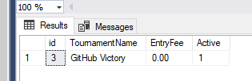

# TournamentTracker
A program that can be used to create teams, members, prizes and tournaments. This project showcases examples of C#, and SQL (Database Design, Stored Procedures) within a Windows Form.
This program can read / write from a Database (SQL Connection) or Text File. 

### Initial Tournament Dashboard 

### Create Prize Dashboard

### Create Team Dashboard

### About to create a tournament

### Checking it has written to DB

